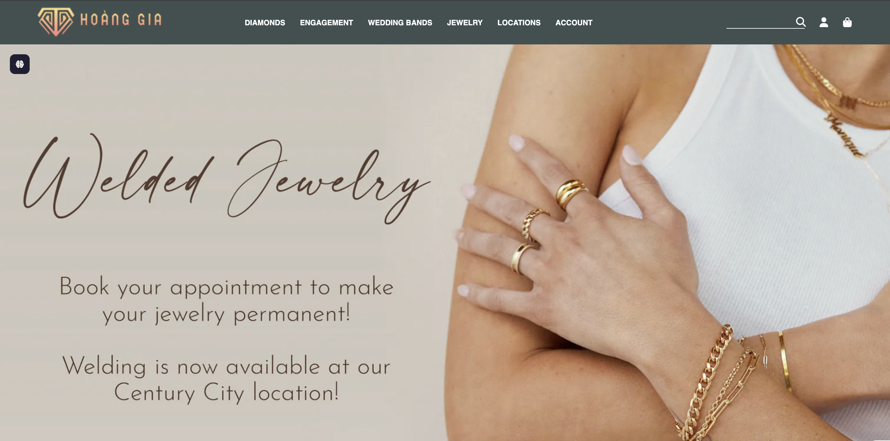
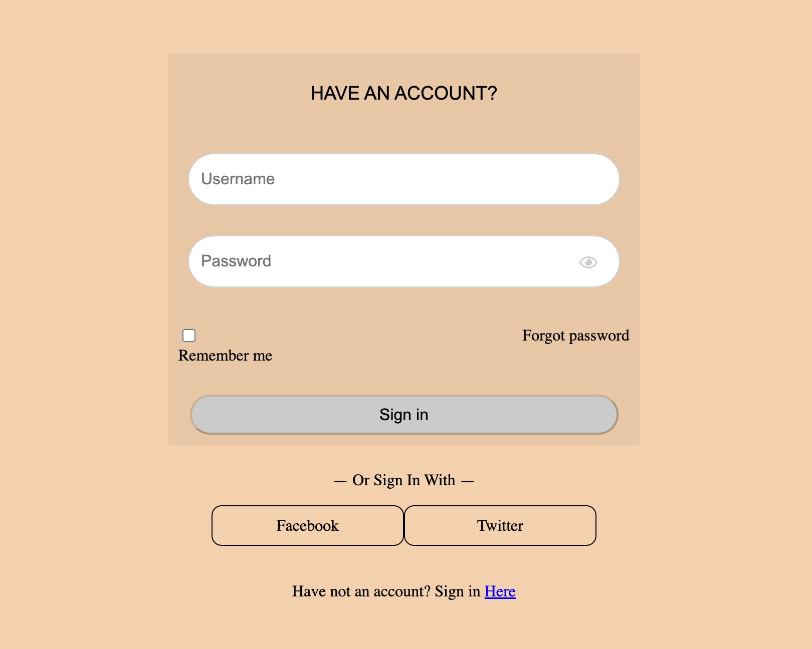
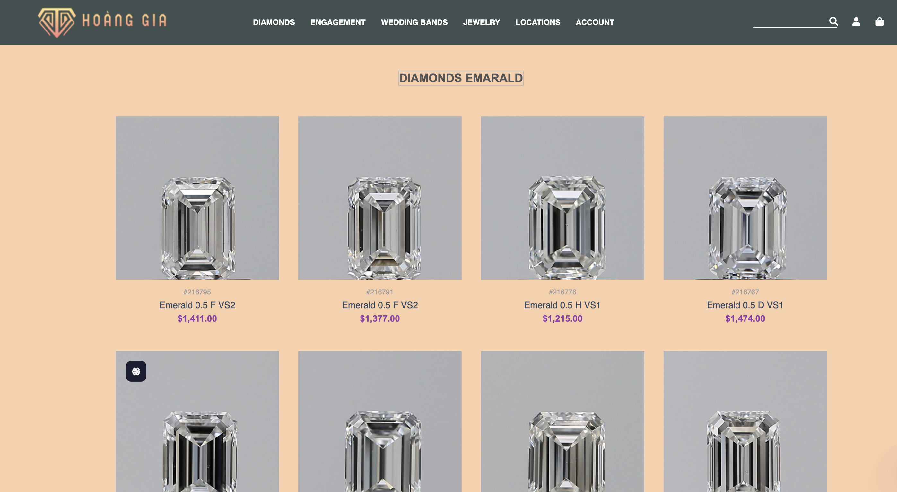
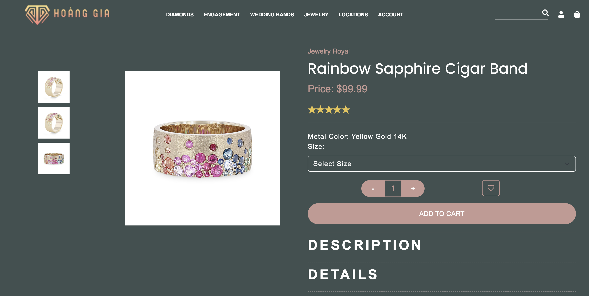

     WEBSITE ROYAL JEWELRY

1.  Giới thiệu
    Website cho phép người dùng xem, tham khảo và lựa chọn các sản phẩm kim cương và trang sức một cách nhanh chóng, tiện lợi và hiện đại.
    Giao diện được thiết kế sang trọng, thân thiện và phù hợp với khách hàng yêu thích trang sức cao cấp.

2.  Chức năng chính
    - Xem trang chủ
    - Xem danh sách sản phẩm
    - Xem chi tiết sản phẩm (SKU, Shape, Carat, Color, Clarity Polish, - Symmetry, Fluorescence)
    - Đăng ký tài khoản
    - Đăng nhập
    - Tìm kiếm sản phẩm
    - Thêm vào giỏ hàng
    - Thêm vào yêu thích
    - Thông báo thêm vào giỏ hàng

3.  Công nghệ sử dụng

- HTML
- CSS
- Javascript

4.  Cấu trúc thư mục
    Royal-Jewelry/
    │── assets/
    │ ├── images/
    │ ├── css/
    │ ├── js/
    │
    │── homepage/
    │ │── index.html
    │
    │── Account/
    │ │── login.html
    │ │── register.html
    │
    │── Product/
    │ │── product-list.html
    │ │── product-detail.html
    │
    │── InfoProduct
    │── README.md

5.  Hướng dẫn cài đặt và chạy chương trình
    5.1. Clone repository về máy
    5.2. Mở file homepage.html

6.  Hình ảnh minh họa

- Giao diện trang chủ
  

- Giao diện đăng nhập
  

- Giao diện sản phẩm
  

- Giao diện chi tiết sản phẩm
  
